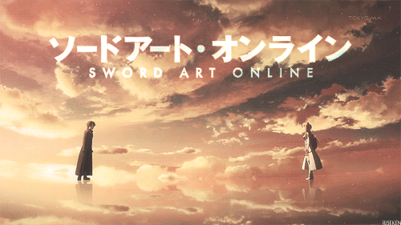

<div align="center">
  
</div>

<br>

<div align="center">
  <h1>THISHANKA METHSHAN</h1>
  <h3>Code • Create • Level Up</h3>
  <p>
    <strong>Software Engineering Undergraduate</strong> • Full-Stack Developer • AI/ML & IoT Explorer
  </p>
</div>

---

## 🗡️ PLAYER PROFILE

```yaml
Name          : Thishanka Methshan Ranasinghe
Callsign      : Shadow
Class         : Software Engineering Undergraduate
Academy       : Lanka Nippon BizTech Institute (LNBTI)
Level         : GPA 3.74 / 4.00
Title         : President — LNBTI IT Club
Rare Title    : Dean's List
Main Quest    : Build useful software with creativity and purpose
Skills        : Full-Stack Development • AI & ML • IoT Systems
```

> I build end-to-end applications — from command-line tools and desktop apps to responsive web apps, PWAs, and AI-powered experiences.  
> Every project is another quest to learn, experiment, and level up.

<div align="center">
  
  
  
  
</div>

---

## 🗺️ TWO REALMS

<table>
  <tr>
    <td width="50%" align="center" valign="top">
      <h3>🌌 Personal Realm</h3>
      <p>Independent builds, experiments & personal projects</p>
      <a href="https://github.com/ThishankaM">
        
      </a>
      <br><br>
      <a href="https://github.com/ThishankaM?tab=repositories"><strong>▶ Browse personal quests</strong></a>
    </td>
    <td width="50%" align="center" valign="top">
      <h3>🏯 Campus Realm</h3>
      <p>University assignments, group work & academic projects</p>
      <a href="https://github.com/Thishanka-SE03">
        
      </a>
      <br><br>
      <a href="https://github.com/Thishanka-SE03?tab=repositories"><strong>▶ Explore campus quests</strong></a>
    </td>
  </tr>
</table>

---

## ⚔️ ACTIVE QUEST LOG

<table>
  <tr>
    <td width="50%" valign="top">
      <h3 align="center">♻️ EcoSphere</h3>
      <p align="center"><em>AI & IoT Smart Waste Management</em></p>
      <p>A progressive web app that turns environmental cleanup into a reward-based adventure using smart waste-management concepts.</p>
      <p align="center">
        
        
        
      </p>
      <p align="center"><a href="https://github.com/ThishankaM?tab=repositories&q=EcoSphere"><strong>[ VIEW QUEST ]</strong></a></p>
    </td>
    <td width="50%" valign="top">
      <h3 align="center">🎵 PulseWave Music</h3>
      <p align="center"><em>Online Music Streaming Platform</em></p>
      <p>A full-stack music experience featuring dynamic discovery, playback, authentication, playlists, likes and media management.</p>
      <p align="center">
        
        
        
      </p>
      <p align="center"><a href="https://github.com/ThishankaM?tab=repositories&q=PulseWave"><strong>[ VIEW QUEST ]</strong></a></p>
    </td>
  </tr>
  <tr>
    <td width="50%" valign="top">
      <h3 align="center">🌱 AgroTrace</h3>
      <p align="center"><em>AI-Powered Agriculture OCR</em></p>
      <p>A mobile document-scanning system that extracts, reviews and manages structured agricultural form data with AI vision.</p>
      <p align="center">
        
        
        
      </p>
      <p align="center"><a href="https://github.com/ThishankaM?tab=repositories&q=AgroTrace"><strong>[ VIEW QUEST ]</strong></a></p>
    </td>
    <td width="50%" valign="top">
      <h3 align="center">💱 Currency Converter</h3>
      <p align="center"><em>Real-Time Exchange Application</em></p>
      <p>A responsive React application that consumes financial APIs, handles asynchronous data and converts currencies in real time.</p>
      <p align="center">
        
        
        
      </p>
      <p align="center"><a href="https://github.com/ThishankaM?tab=repositories&q=Currency"><strong>[ VIEW QUEST ]</strong></a></p>
    </td>
  </tr>
</table>

---

## 🌳 SKILL TREE

<div align="center">

### 🗡️ Core Languages


### 🛡️ Frontend Armor


### 🔮 Backend Magic


### 🧰 Inventory


### ✨ Special Abilities


</div>

---

## 🏆 ACHIEVEMENTS UNLOCKED

<div align="center">

[](https://github.com/ryo-ma/github-profile-trophy)

| Achievement | Unlock Condition |
|:-----------:|:-----------------|
| 🥇 **Dean's List** | Outstanding academic performance |
| 👑 **Guild Leader** | President of the LNBTI IT Club |
| 🎓 **Software Engineer I** | Diploma in Software Engineering |
| 🗾 **Language Adventurer** | Japanese NAT N5 certified |
| 🌍 **Eco Innovator** | Built an AI & IoT sustainability platform |

</div>

---

## 📊 BATTLE RECORDS

<div align="center">

### Personal Save File


### Campus Save File
<a href="https://github.com/Thishanka-SE03">
  
</a>


</div>

---

## 🤝 PARTY RECRUITMENT

<div align="center">

Got a project idea, internship, or co-op quest? Let's form a party.

[](https://github.com/ThishankaM)
[](https://github.com/Thishanka-SE03)
[](https://www.linkedin.com/in/thishanka-ranasinghe/)
[](mailto:thishanka.methshan.ranasinghe@gmail.com)

<br>

### The next level starts with one more commit.

<sub>STATUS: ONLINE • OPEN TO COLLABORATIONS</sub>

</div>

<br>

<div align="center">
  
</div>
